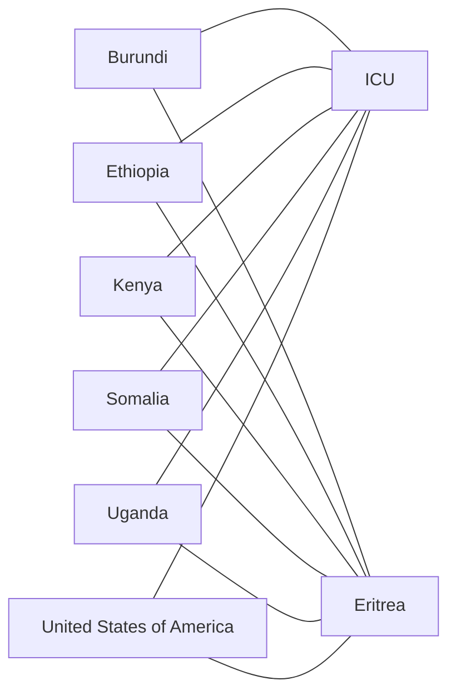

# The Networks of War

A study of networks by war using data from the Correlates of War (COW) project.

## Backend

The DuckDB backend rebuilds the first preprocessing notebook with native SQL. Python only resolves file paths,
normalizes the extra-state CSV encoding, and runs the SQL files in order.

## Setup

From `the_networks_of_war/backend`:

```bash
python3 -m venv .venv
source .venv/bin/activate
pip install -e ".[dev]"
```

## Data Layout

Raw CSV files are read from `csvs/`, which is ignored by git. The extra-state CSV is copied to UTF-8 under
ignored `backend/.work/` before DuckDB reads it. The generated DuckDB database is also ignored:

- `the_networks_of_war/backend/.work/`
- `the_networks_of_war/backend/the_networks_of_war.duckdb`

## Pipeline Commands

From `the_networks_of_war/backend`:

```bash
python src/pipeline.py
```

Run or rebuild Step 1:

```bash
python src/pipeline.py --step 1
python src/pipeline.py --step all
```

Print table row counts after running the selected step:

```bash
python src/pipeline.py --inspect
python src/pipeline.py --step 1 --inspect
```

Query the existing DuckDB database without rebuilding it:

```bash
python src/pipeline.py --step none --query "select count(*) as row_count from initial_dyads"
python src/pipeline.py --step none --query "select * from initial_wars limit 10"
```

Run Step 1, then query the freshly rebuilt tables:

```bash
python src/pipeline.py --step 1 --query "select war_num, war_name from initial_wars limit 10"
```

Use non-default input or database paths:

```bash
python src/pipeline.py --csv-dir ../csvs --db-path the_networks_of_war.duckdb --step 1
```

## Test Commands

From `the_networks_of_war/backend`:

```bash
pytest
```

Run the Step 1 expectation tests:

```bash
pytest tests/test_step_1_expectations.py
pytest tests/test_step_1_expectations.py -q
```

Run a single test or matching group of tests:

```bash
pytest tests/test_step_1_expectations.py -k "negative_date_sentinels"
pytest tests/test_step_1_expectations.py -k "date_macros or initial_dyads"
```

Show verbose test names and failures:

```bash
pytest tests/test_step_1_expectations.py -vv
```

The Step 1 expectation tests rebuild Step 1 into a temporary DuckDB database. They skip automatically if the ignored
raw CSV files in `csvs/` are not available locally.

## Step 1 Sources And Tables

The current backend ingests the following source files and uses the matching documentation in `documentation/` where available.
The online source column is a placeholder for links to the original data pages.

| Table | Source CSV | Documentation | Online source |
| --- | --- | --- | --- |
| `source_country_codes` | `COW country codes.csv` | `Entities.pdf` | TODO |
| `source_extrastate_wars` | `Extra-StateWarData_v4.0.csv` | `Extra-StateWars_Codebook.pdf` | TODO |
| `source_interstate_mid_dyads` | `dyadic_mid_4.02.csv` | `Dyadic MID Codebook V4.0.pdf` | TODO |
| `source_interstate_war_dyads` | `directed_dyadic_war.csv` | `The Directed Dyadic Interstate War Dataset Codebook.pdf` | TODO |
| `source_interstate_wars` | `Inter-StateWarData_v4.0.csv` | `MII_v4.0_Codebook.pdf` | TODO |
| `source_intrastate_wars` | `INTRA-STATE_State_participants v5.1.csv` | `Codebook for Intra-state v5.1 2.9.20.pdf`; `Description of Intra-state v5.1.pdf` | TODO |
| `source_war_types` | `war_types.csv` | local helper file with no external codebook | TODO |

Other files in `documentation/` correspond to datasets that have not yet been incorporated and were not used for
the current Step 1 assumptions.

Step 1 also materializes transformed tables:

- `dyads_after_mid`
- `dyads_after_sources`
- `war_dyads`
- `war_participants`

Step 1 also materializes compatibility tables:

- `initial_dyads`
- `initial_participants`
- `initial_wars`

## Ingestion Assumptions

### Source Tables

- Source table names beginning with `source_` mean the table comes directly from one CSV file, with only type coercion,
  column renaming, encoding normalization, and explicit data-entry fixes applied during load.

### Excluded Calculated Columns

- Source columns that are documented as simple calculations from other source columns are not ingested. Currently
  excluded calculated fields are `batdths` and `durindx` from `directed_dyadic_war.csv`; `durindx`, `duration`, and
  `cumdurat` from `dyadic_mid_4.02.csv`; and `WDuratDays`, `WDuratMo`, and `TotalBDeaths` from
  `INTRA-STATE_State_participants v5.1.csv`. Duration and day-count fields are excluded because they should be
  calculated from the pipeline's resolved start and end dates, after applying the date assumptions below, such as using
  the last day of the year when only the end year is known.

### Date Values

- Blank strings are loaded as null. Text values `-7`, `-8`, and `-9` are also treated as null because the COW codebooks
  use negative values for ongoing, not applicable, or unknown values.
- Negative day, month, and start-year date fields are loaded as null. Negative end-year values are loaded as null except
  for `-7`, which the COW codebooks document as the ongoing-war marker.
- Missing, invalid, unknown, or not-applicable start months are interpreted as January, and start days are interpreted
  as day `1` of the resolved month.
- Missing, invalid, unknown, or not-applicable end months are interpreted as December, and end days are interpreted as
  the last day of the resolved month.
- Day values are capped to the last valid day of the resolved month, so an end date with year `2012`, month `10`, and
  missing day resolves to `2012-10-31`.
- End year `-7` is treated as ongoing and resolved to December 31 of the current year at pipeline runtime.
- A date is flagged as estimated when the year is an ongoing marker or when a positive year has a missing or invalid
  month or day.

### Encoding And Deduplication

- `COW country codes.csv` is deduplicated by `c_code`; the first row per code is retained.
- `Extra-StateWarData_v4.0.csv` is read as `cp1252` and copied to UTF-8 in `backend/.work/` before DuckDB reads it.
- `directed_dyadic_war.csv`, `dyadic_mid_4.02.csv`, `Inter-StateWarData_v4.0.csv`, and
  `INTRA-STATE_State_participants v5.1.csv` are read with `latin-1` encoding.

### Field Normalization

- `dyadic_mid_4.02.csv` side-specific fatality levels are converted during ingestion to representative battle-death
  estimates as follows: `0 -> 0`, `1 -> 25`, `2 -> 100`, `3 -> 250`, `4 -> 500`, `5 -> 999`, and `6 -> 1000`.
- Participant names are normalized only for known display and matching issues: United States, Baron von
  Ungern-Sternberg's White army, Janissaries, Turkey/Ottoman Empire/Egypt, and a small set of lower-case rebel,
  resistance, sultanate, and tribe suffixes.

## Transformation Assumptions

### Table Shape

- Directed dyadic interstate war records get war name and war type metadata from `source_interstate_wars` by `war_num`.
- Transformed tables do not carry source-only identifiers and outcome fields (`disno`, `dyindex`, `outcome_a`,
  `outcome_b`, and `outcome`) after they are no longer needed as table outputs. MID matching still uses `disno`
  internally where needed.
- After source date components are resolved, transformed tables carry `start_date`, `end_date`, and date-estimation
  flags instead of the original day/month/year component columns.

### Source War Dyads And Participants

- Extra-state and intra-state war dyads are treated as side A versus side B rows, with side A assigned side `1` and
  side B assigned side `2`.
- Extra-state and intra-state participant rows are derived from both sides of the corresponding dyad rows.

### Date Spans

- For extra-state and intra-state rows with multiple date spans, the pipeline uses the earliest start date and latest
  end date as the war dyad/participant span.
- Interstate participant dates use the earliest start date and latest end date across the two source date spans.

### Directed Dyads And MID Records

- Participants that appear on both side 1 and side 2 in dyadic data are assigned side `3` programmatically.
- `dyads_after_sources` makes source war dyads directed by adding a reversed copy of each dyad.
- `dyads_after_mid` adds dyadic MID records to source war dyads.
- Only dyadic MID records with `war = 1` are incorporated.
- MID dyads are not incorporated when the same directed dyad in the same war overlaps an existing source war-dyad row.
- Existing battle-death values take precedence over MID fatality estimates for remaining merged rows. MID estimates are
  used when summed source battle deaths are null or zero and summed estimates are positive.
- MID dyads are assigned to known wars by `disno` when possible.
- MID dyads that cannot be assigned by `disno` are assigned to World War II (`war_num = 139`) when their start year is
  1945 or earlier.
- Unmatched MID dispute `4339` is assigned to Africa's World War (`war_num = 905`).
- The unmatched Lebanon-Israel MID conflict (`disno = 4182`) is assigned synthetic `war_num = 4182` and named
  `Israeli–Hezbollah Conflict (South Lebanon)` because no matching war number exists in the interstate war data.

### Participant Inference

- Participants found in dyadic data but missing from `war_participants` are added to `initial_participants` from the
  dyadic side A records.
- Missing participant sides are inferred from the opposite participant in dyadic data when that inference is unambiguous.
- Inferred dyads are created by choosing anchor participants for each war. An anchor is a participant that is treated as
  a known adversary for all overlapping participants on the opposite side when source dyadic records are incomplete.
- Anchor selection is independent by side and participant type. A participant is selected as an anchor when its side has
  exactly one total participant, exactly one named non-state participant, or exactly one state participant. More than one
  anchor can be selected for the same war, including anchors on both sides.
- Named non-state participants with COW code `-8` are retained in `initial_dyads`. Unnamed or literal aggregate
  placeholders are excluded.

For example, in the Third Somalia War (`war_num = 940.8`), the source intra-state participant file lists six side 1
states and two side 2 participants. Side 2 has exactly one named non-state participant, ICU (`c_code = -8`), and exactly
one state participant, Eritrea (`c_code = 531`), so both become anchors.

| Side | Source participants | Anchor rule | Selected anchors |
| --- | --- | --- | --- |
| 1 | United States of America, Uganda, Kenya, Burundi, Somalia, Ethiopia | No single total, non-state, or state participant | None |
| 2 | ICU, Eritrea | One named non-state participant; one state participant | ICU, Eritrea |

Those anchors are then linked to every overlapping participant on the opposite side:



### Initial Dyads

- Source dyads with COW code `-8` on one side are expanded against every actual participant on that side. For example,
  if `c_code_a = -8`, side B is treated as having fought each source participant on side A for that conflict.
- Unnamed aggregate dyads are excluded from `initial_dyads` after those rows are used for named-participant expansion.
- Inferred dyads are only created where the anchor and opposing participant date ranges overlap.
- `initial_dyads` expands dyads into one row per year for years in the range `1500` through `2099`.

## Data-Entry Fixes And Assignment Rules

- `directed_dyadic_war.csv`
  - Start month is corrected from original value `24` to `12`.
  - End year is corrected from original value `19118` to `1918`.
  - The World War II Thailand dyad (`war_num = 139`, `statea = 800`, `stateb = 710`) is loaded with Thailand battle
    deaths corrected from original blank `batdtha` to `5,569`. The Thailand death count comes from Wikipedia's summary
    of Thailand in World War II:
    <https://en.wikipedia.org/wiki/Thailand_in_World_War_II>.
- `dyadic_mid_4.02.csv`
  - The source does not include COW war numbers, so rows are assigned to known wars by matching `disno` to
    `directed_dyadic_war.csv` where possible.
  - Unmatched MID rows with start years through `1945` are assigned from original missing `war_num` to World War II
    (`war_num = 139`) after manual review.
  - Unmatched MID dispute `4339` is assigned from original missing `war_num` to Africa's World War (`war_num = 905`)
    after manual review.
  - Unmatched MID dispute `4182` between Lebanon (`660`) and Israel (`666`) is assigned synthetic `war_num = 4182` and
    named `Israeli–Hezbollah Conflict (South Lebanon)`. This fake war id uses the MID `disno` because the conflict
    appears in the dyadic MID records with `war = 1`, but no corresponding `war_num` exists for it in the interstate
    war data.
- `INTRA-STATE_State_participants v5.1.csv`
  - War number is corrected from original value `977` to `979`.
  - War `976` has `StartYr1` corrected from original value `2001` to `2011`.
  - Wars `942`, `990.4`, `991`, `991.4`, and `992.5` are treated as ongoing by setting `EndYr1` to `-7`; the original
    source values include `-7`, `-8`, and `-9`, but only `-7` is treated as an ongoing end-year marker. Other negative
    end-year values are loaded as null because the codebooks use them for not applicable or unknown values.
