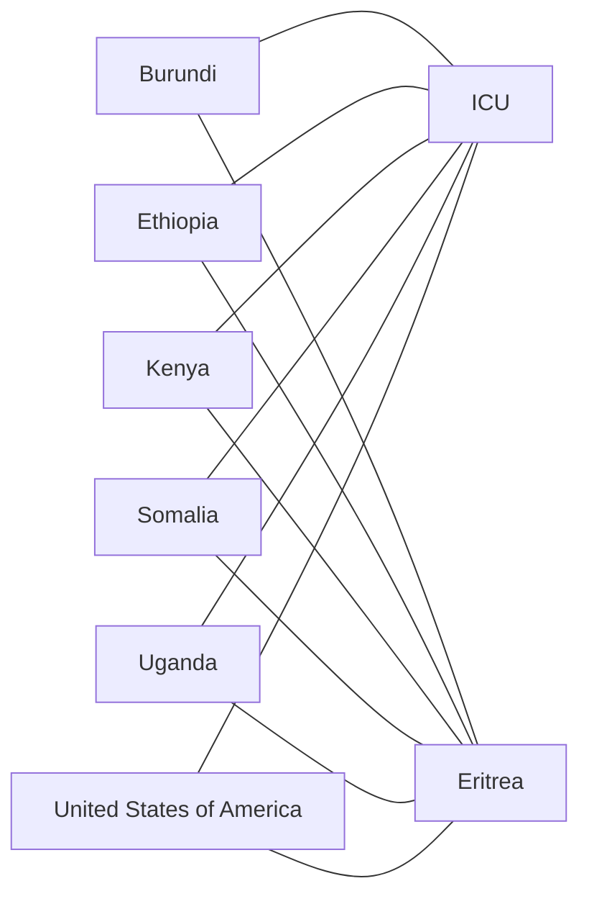

# The Networks of War

A study of networks by war using data from the Correlates of War (COW) project.

## Table Of Contents

- [Backend](#backend)
- [Setup](#setup)
- [Data Layout](#data-layout)
- [Pipeline Commands](#pipeline-commands)
- [Test Commands](#test-commands)
- [Source Tables](#source-tables)
  - [Step 1 Source Tables](#step-1-source-tables)
  - [Step 2 Source Tables](#step-2-source-tables)
- [Ingestion Assumptions](#ingestion-assumptions)
  - [Source Ingestion Rules](#source-ingestion-rules)
  - [Excluded Calculated Columns](#excluded-calculated-columns)
  - [Date Values](#date-values)
  - [Encoding And Deduplication](#encoding-and-deduplication)
  - [Field Normalization](#field-normalization)
- [Transformation Assumptions](#transformation-assumptions)
  - [Table Shape](#table-shape)
  - [Source War Dyads And Participants](#source-war-dyads-and-participants)
  - [Date Spans](#date-spans)
  - [Directed Dyads And MID Records](#directed-dyads-and-mid-records)
  - [Participant Inference](#participant-inference)
  - [Dyads](#dyads)
- [Data-Entry Fixes And Assignment Rules](#data-entry-fixes-and-assignment-rules)

## Backend

The DuckDB backend rebuilds preprocessing steps with native SQL. Python resolves file paths, prepares downloaded source
files, normalizes configured CSV encodings, and runs the SQL files in order.

## Setup

From `the_networks_of_war/backend`:

```bash
python3 -m venv .venv
source .venv/bin/activate
pip install -e ".[dev]"
```

## Data Layout

Source data is downloaded into `backend/data/`, which is ignored by git. Each external source table gets its own
subdirectory named after the source key, such as `backend/data/interstate_mid_dyads/`. Source download metadata lives in
`backend/manual/source_metadata.json`. The extra-state CSV encoding override is also defined there; that CSV is copied
to UTF-8 under ignored `backend/.work/` before DuckDB reads it. The generated DuckDB database is ignored:

- `the_networks_of_war/backend/data/`
- `the_networks_of_war/backend/.work/`
- `the_networks_of_war/backend/the_networks_of_war.duckdb`

## Pipeline Commands

From `the_networks_of_war/backend`:

```bash
python src/pipeline.py
```

Pipeline parameters:

| Parameter | Default | Demonstration |
| --- | --- | --- |
| `--data-dir PATH` | `backend/data/` | Source-data directory. Use `--data-dir data` for the default relative backend path. |
| `--csv-dir PATH` | `backend/data/` | Backward-compatible alias for `--data-dir`; use `--csv-dir data` only for older scripts. |
| `--db-path PATH` | `backend/the_networks_of_war.duckdb` | DuckDB database path. Use `--db-path the_networks_of_war.duckdb` for the default relative backend path. |
| `--step {none,all,1,2,3}` | `all` | `all` rebuilds Steps 1 and 2; `1` rebuilds Step 1; `2` rebuilds Step 2 source tables; `3` is an accepted placeholder and currently raises `NotImplementedError`; `none` skips preprocessing. |
| `--inspect` | off | Print table row counts after the selected step runs. |
| `--prepare-data` | off | Download and validate missing source-data folders before opening the database. |
| `--recreate-data` | off | Delete and recreate the full source-data directory before opening the database. |
| `--query SQL` | none | Execute an inline SQL query after the selected step runs. |
| `--query-file PATH` | none | Execute SQL read from a local `.sql` file after the selected step runs. Mutually exclusive with `--query`. |

Run or rebuild Step 1:

```bash
python src/pipeline.py --step 1
```

Run all rebuilt steps:

```bash
python src/pipeline.py --step all
```

Run or rebuild Step 2 source tables:

```bash
python src/pipeline.py --step 2
```

Print table row counts after running the selected step:

```bash
python src/pipeline.py --inspect
python src/pipeline.py --step 1 --inspect
```

Query the existing DuckDB database without rebuilding it:

```bash
python src/pipeline.py --step none --query "select count(*) as row_count from dyads"
python src/pipeline.py --step none --query "select * from wars limit 10"
```

Query from a local SQL file:

```bash
python src/pipeline.py --step none --query-file queries/war_counts.sql
```

Run Step 1, then query the freshly rebuilt tables:

```bash
python src/pipeline.py --step 1 --query "select war_num, war_name from wars limit 10"
```

Use non-default input or database paths:

```bash
python src/pipeline.py --data-dir data --db-path the_networks_of_war.duckdb --step 1
```

Use the legacy `--csv-dir` alias for older scripts:

```bash
python src/pipeline.py --csv-dir data --db-path the_networks_of_war.duckdb --step 1
```

Create missing source-data subdirectories without running a preprocessing step:

```bash
python src/pipeline.py --prepare-data --step none
```

Recreate the full ignored source-data directory:

```bash
python src/pipeline.py --recreate-data --step none
```

Step 3 has not been rebuilt yet:

```bash
python src/pipeline.py --step 3
```

The Step 3 command currently stops with `NotImplementedError`.

## Test Commands

From `the_networks_of_war/backend`:

```bash
pytest
```

Run the Step 1 expectation tests:

```bash
pytest tests/test_step_1.py
pytest tests/test_step_1.py -q
```

Run a single test or matching group of tests:

```bash
pytest tests/test_step_1.py -k "negative_date_sentinels"
pytest tests/test_step_1.py -k "date_macros or dyads"
```

Show verbose test names and failures:

```bash
pytest tests/test_step_1.py -vv
```

The Step 1 expectation tests rebuild Step 1 into a temporary DuckDB database. They skip automatically if the ignored
source files in `backend/data/` are not available locally.

## Source Tables

The current backend ingests the following source files. Downloaded source subdirectories include the relevant PDFs and
supporting files from each source bundle when available. When a source has multiple downloads, the download cell is
split with line breaks so each source file or documentation link remains visible.

### Step 1 Source Tables

| Table | Source CSV | Version | Download source |
| --- | --- | --- | --- |
| `source_country_codes` | `COW-country-codes.csv` | unversioned | [COW country codes CSV](https://correlatesofwar.org/wp-content/uploads/COW-country-codes.csv) |
| `source_extrastate_wars` | `Extra-StateWarData_v4.0.csv` | 4.0 | [Extra-state wars CSV](https://correlatesofwar.org/wp-content/uploads/Extra-StateWarData_v4.0.csv)<br>[extra-state wars codebook](https://correlatesofwar.org/wp-content/uploads/Extra-StateWars_Codebook.pdf) |
| `source_interstate_mid_dyads` | `dyadic_mid_4.03.csv` | 4.03 | [dyadic MID 4.03 update ZIP](https://correlatesofwar.org/wp-content/uploads/dyadic_mid_4.03_update.zip) |
| `source_interstate_war_dyads` | `directed_dyadic_war.csv` | unversioned | [dyadic interstate war dataset ZIP](https://correlatesofwar.org/wp-content/uploads/Dyadic-Interstate-War-Dataset.zip) |
| `source_interstate_wars` | `Inter-StateWarData_v4.0.csv` | 4.0 | [inter-state wars CSV](https://correlatesofwar.org/wp-content/uploads/Inter-StateWarData_v4.0.csv)<br>[inter-state wars list](https://correlatesofwar.org/wp-content/uploads/Inter-StateWarsList.pdf)<br>[inter-state wars codebook](https://correlatesofwar.org/wp-content/uploads/Inter-StateWars_Codebook.pdf) |
| `source_intrastate_wars` | `INTRA-STATE_State_participants v5.1 CSV.csv` | 5.1 | [intra-state wars 5.1 ZIP](https://correlatesofwar.org/wp-content/uploads/Intra-State-Wars-v5.1.zip) |

### Step 2 Source Tables

| Table | Source CSV | Version | Download source |
| --- | --- | --- | --- |
| `source_global_terrorism_database` | `globalterrorismdb_0522dist.csv`<br>`globalterrorismdb_2021Jan-June_1222dist.csv` | 0522 + 2021 Jan-June 1222 | [GTD codebook](https://www.start.umd.edu/sites/default/files/2024-10/Codebook.pdf)<br>[GTD 0522 workbook](https://www.start.umd.edu/system/files/globalterrorismdb_0522dist.xlsx)<br>[GTD 2021 Jan-June workbook](https://www.start.umd.edu/system/files/globalterrorismdb_2021Jan-June_1222dist.xlsx) |
| `source_formal_alliances_directed_yearly` | `alliance_v4.1_by_directed_yearly.csv` | 4.1 | [COW formal alliances 4.1 ZIP](https://correlatesofwar.org/wp-content/uploads/version4.1_csv.zip) |
| `source_territorial_changes` | `tc2018.csv` | 6 | [territorial changes v6 ZIP](https://correlatesofwar.org/wp-content/uploads/terr-changes-v6.zip) |
| `source_forcibly_displaced_populations` | `FDP2008a.csv` | 2008a | [FDP workbook](http://www.systemicpeace.org/inscr/FDP2008a.xls)<br>[FDP codebook](http://www.systemicpeace.org/inscr/FDPCodebook2008.pdf) |
| `source_colonial_dependency_contiguity` | `contcold.csv` | 3.1 | [colonial/dependency contiguity 3.1 ZIP](https://correlatesofwar.org/wp-content/uploads/ColonialContiguity310.zip) |
| `source_direct_contiguity` | `contdird.csv` | 3.2 | [direct contiguity 3.2 ZIP](https://correlatesofwar.org/wp-content/uploads/DirectContiguity320.zip) |
| `source_defense_cooperation_agreements` | `DCAD-v1.0-dyadic.csv` | 1.0 | [defense cooperation agreements ZIP](https://correlatesofwar.org/wp-content/uploads/kinne_dca.zip) |
| `source_intergovernmental_organizations_dyadic` | `dyadic_formatv3.csv` | 3 | [IGO dyadic format v3 ZIP](https://correlatesofwar.org/wp-content/uploads/dyadic_formatv3.zip)<br>[IGO codebook](https://correlatesofwar.org/wp-content/uploads/IGO-Codebook_v3_short-copy.pdf) |
| `source_diplomatic_exchange` | `Diplomatic_Exchange_2006v1.csv` | 2006.1 | [diplomatic exchange 2006.1 ZIP](https://correlatesofwar.org/wp-content/uploads/Diplomatic_Exchange_2006.1.zip) |
| `source_dd_revisited` | `ddrevisited_data_v1.csv` | 1 | [DD revisited data](https://github.com/cyaris/the_networks_of_war/releases/download/source-data-dd-revisited-v1/ddrevisited_data_v1.csv)<br>[DD revisited codebook](https://rforpoliticalscience.com/wp-content/uploads/2022/04/ddrevisited-codebook.pdf) |
| `source_co_emissions_per_capita` | `co-emissions-per-capita.csv` | 1 | [OWID CO2 emissions per capita CSV](https://ourworldindata.org/grapher/co-emissions-per-capita.csv?v=1&csvType=full&useColumnShortNames=true) |
| `source_arms_technology` | `cow_arms_tech_long.csv` | 1.1 | [COW arms technology 1.1 ZIP](https://correlatesofwar.org/wp-content/uploads/Arms-TechnologyV1.1.zip) |
| `source_atop_dyadic_years` | `atop5_1ddyr.csv` | 5.1 | [ATOP 5.1 dyadic-years ZIP](http://www.atopdata.org/uploads/6/9/1/3/69134503/atop_5.1__.csv_.zip)<br>[ATOP 5.1 codebook](http://www.atopdata.org/uploads/6/9/1/3/69134503/atop_5_1_codebook.pdf) |
| `source_mtops_dyadic` | `mtopsd150.csv` | 1.5 | [MTOPS 1.5 ZIP](https://www.paulhensel.org/Data/mtops.zip) |
| `source_cow_trade_dyadic` | `Dyadic_COW_4.0.csv` | 4.0 | [COW trade 4.0 ZIP](https://correlatesofwar.org/wp-content/uploads/COW_Trade_4.0.zip) |
| `source_cow_trade_national` | `National_COW_4.0.csv` | 4.0 | [COW trade 4.0 ZIP](https://correlatesofwar.org/wp-content/uploads/COW_Trade_4.0.zip) |
| `source_national_material_capabilities` | `NMC-70-wsupplementary.csv` | 7.0 | [NMC v7 ZIP](https://correlatesofwar.org/wp-content/uploads/NMCv7.zip) |

Other files in the legacy ignored `documentation/` directory correspond to datasets that have not yet been incorporated
and were not used for the current Step 1 or Step 2 assumptions.

Step 1 materializes reference tables:

- `country_codes`
- `war_types`

`war_types` is maintained as inline SQL reference data: `05_create_reference_tables.sql` creates the table and
`06_insert_reference_tables.sql` inserts the rows.

Step 1 also materializes transformed tables:

- `dyads_after_mid`
- `dyads_after_sources`
- `war_participants`

Step 1 also materializes compatibility tables:

- `dyads`
- `dyad_years`
- `participants`
- `wars`

## Ingestion Assumptions

### Source Ingestion Rules

- The primary source tables listed above come directly from their source CSV files, with only type coercion, column
  renaming, encoding normalization, and the data-entry fixes documented below applied during load.
- `source_global_terrorism_database` stacks two prepared GTD CSVs with `union all` after confirming the two files do
  not overlap on `eventid`.
- `dyadic_mid_4.03.csv` has no new columns relative to `dyadic_mid_4.02.csv` and no longer includes the 4.02 columns
  `dyad`, `abbreva`, `abbrevb`, `lastobs`, and `newar`.
- Version-scoped source adjustments live in `backend/sql/step_1/03_create_source_adjustment_tables.sql` and
  `backend/sql/step_1/04_insert_source_adjustments.sql`. The first file creates `source_file_versions` and adjustment
  tables; the second inserts adjustment rows for source facts that are not present in the source CSVs. Downstream
  transformations join adjustment tables to `source_file_versions` when an assignment is version-scoped. Data-entry
  fixes applied while reading source CSVs are documented below.
- Reference data that is not tied to an external source file, currently `war_types`, is created and inserted in
  `backend/sql/step_1/05_create_reference_tables.sql` and
  `backend/sql/step_1/06_insert_reference_tables.sql`.

### Excluded Calculated Columns

- Source columns that are documented as simple calculations from other source columns are not ingested. Currently
  excluded calculated fields are `batdths` and `durindx` from unversioned `directed_dyadic_war.csv`; `durindx`, `duration`, and
  `cumdurat` from `dyadic_mid_4.03.csv`; and `WDuratDays`, `WDuratMo`, and `TotalBDeaths` from
  `INTRA-STATE_State_participants v5.1.csv`. Duration and day-count fields are excluded because they should be
  calculated from the pipeline's resolved start and end dates, after applying the date assumptions below, such as using
  the last day of the year when only the end year is known.

### Date Values

- Blank strings are loaded as `null`. Text values `-7`, `-8`, and `-9` are also treated as `null` because the COW codebooks
  use negative values for ongoing, not applicable, or unknown values.
- Negative day, month, and start-year date fields are loaded as `null`. Negative end-year values are loaded as `null` except
  for `-7`, which the COW codebooks document as the ongoing-war marker.
- Missing, invalid, unknown, or not-applicable start months are interpreted as January, and start days are interpreted
  as day `1` of the resolved month.
- Missing, invalid, unknown, or not-applicable end months are interpreted as December, and end days are interpreted as
  the last day of the resolved month.
- Day values are capped to the last valid day of the resolved month, so an end date with year `2012`, month `10`, and
  missing day resolves to `2012-10-31`.
- End year `-7` is treated as ongoing and resolved to December 31 of the current year at pipeline runtime.
- A date is flagged as estimated when the year is an ongoing marker or when a positive year has a missing or invalid
  month or day.
- Raw source date components are expected to be in basic valid domains before cleaning: months `1-12`, days `1-31`,
  and years `1500-2100`, while COW sentinels `-7`, `-8`, and `-9` are allowed. Values outside these domains are treated
  as data-entry issues and documented below when accepted by the pipeline.

### Encoding And Deduplication

- `COW country codes.csv` is deduplicated by `c_code`; the first row per code is retained.
- `Extra-StateWarData_v4.0.csv` is read as `cp1252` and copied to UTF-8 in `backend/.work/` before DuckDB reads it.
- `directed_dyadic_war.csv`, `dyadic_mid_4.03.csv`, `Inter-StateWarData_v4.0.csv`, and
  `INTRA-STATE_State_participants v5.1.csv` are read with `latin-1` encoding.

### Field Normalization

- `dyadic_mid_4.03.csv` side-specific fatality levels are converted during ingestion to representative battle-death
  estimates as follows: `0 -> 0`, `1 -> 25`, `2 -> 100`, `3 -> 250`, `4 -> 500`, `5 -> 999`, and `6 -> 1000`.
- Participant names are normalized only for known display and matching issues: United States, Baron von
  Ungern-Sternberg's White army, Janissaries, Turkey/Ottoman Empire/Egypt, and a small set of lower-case rebel,
  resistance, sultanate, and tribe suffixes.

## Transformation Assumptions

### Table Shape

- Directed dyadic interstate war records get war name and war type metadata from `source_interstate_wars` by `war_num`;
  synthetic MID-only wars get metadata from source adjustment tables.
- Transformed tables do not carry source-only identifiers and outcome fields (`disno`, `dyindex`, `outcome_a`,
  `outcome_b`, and `outcome`) after they are no longer needed as table outputs. MID matching still uses `disno`
  internally where needed.
- After source date components are resolved, transformed tables carry `start_date`, `end_date`, and date-estimation
  flags instead of the original day/month/year component columns.

### Source War Dyads And Participants

- Extra-state and intra-state war dyads are treated as side A versus side B rows, with side A assigned side `1` and
  side B assigned side `2`.
- Extra-state and intra-state participant rows are derived from both sides of the corresponding dyad rows.
- Directed dyadic interstate source rows do not materialize `side_a` or `side_b`; row position is already represented
  by `c_code_a` and `c_code_b`. The original directed dyadic role fields are retained as `role_a`, `role_b`,
  `dyad_role_a`, and `dyad_role_b`.
- In the transformed `war_dyads` view, interstate `side_a` and `side_b` are resolved back to substantive participant
  sides from `source_interstate_wars`; extra-state and intra-state dyads keep their source side A versus side B
  convention.

### Date Spans

- For extra-state and intra-state rows with multiple date spans, the pipeline uses the earliest start date and latest
  end date as the war dyad/participant span.
- Interstate participant dates use the earliest start date and latest end date across the two source date spans.
- Source rows with multiple date spans are validated by date pair before spans are collapsed. A bad pair such as
  `start_1 > end_1` should be corrected or explicitly accepted before relying on the row-level earliest-start/latest-end
  span.

### Directed Dyads And MID Records

- Participants that appear on both side 1 and side 2 in dyadic data are assigned side `3` programmatically.
- `dyads_after_sources` makes source war dyads directed by adding a reversed copy of each dyad.
- `dyads_after_mid` adds dyadic MID records to source war dyads.
- Only dyadic MID records with `war = 1` are incorporated.
- MID dyads are not incorporated when the same directed dyad in the same war overlaps an existing source war-dyad row.
- Existing battle-death values take precedence over MID fatality estimates for remaining merged rows. MID estimates are
  used when summed source battle deaths are `null` or zero and summed estimates are positive.
- MID dyads are assigned to known wars by `disno` from `source_interstate_war_dyads` and version-scoped rows in
  `source_interstate_mid_war_num_adjustments`.
- Missing MID `disno` to `war_num` relationships are stored in the Step 1 source adjustment tables when the current CSV
  version still needs them. If a future CSV version introduces a new unmatched MID war,
  `test_mid_dyads_resolve_all_mid_war_numbers` should fail until the source adjustment file is updated or the new source
  data is accepted as authoritative.
- Synthetic war metadata, such as the Lebanon-Israel MID conflict (`disno = 4182`) named
  `Israeli–Hezbollah Conflict (South Lebanon)`, is stored in `source_interstate_war_metadata_adjustments` and joined
  during transformation without adding partial rows to `source_interstate_wars`.

### Participant Inference

- Participants found in dyadic data but missing from `war_participants` are added to `participants` from the
  dyadic side A records.
- Missing participant sides are inferred from the opposite participant in dyadic data when that inference is unambiguous.
- Remaining version-specific participant side assignments are stored in `source_participant_side_adjustments` and joined
  during participant creation.
- Interstate war participant sides are taken from `source_interstate_wars`, either directly in `war_participants` or
  through semantic side values on `war_dyads`, because the directed dyadic source can include reciprocal rows where the
  same state appears as both `c_code_a` and `c_code_b` for the same war or dispute.
- Inferred dyads are created by choosing anchor participants for each war. An anchor is a participant that is treated as
  a known adversary for all overlapping participants on the opposite side when source dyadic records are incomplete.
- Anchor selection is independent by side and participant type. A participant is selected as an anchor when its side has
  exactly one total participant, exactly one named non-state participant, or exactly one state participant. More than one
  anchor can be selected for the same war, including anchors on both sides.
- Named non-state participants with COW code `-8` are retained in `dyads`. Unnamed or literal aggregate
  placeholders are excluded.

For example, in the Third Somalia War (`war_num = 940.8`), the source intra-state participant file lists six side 1
states and two side 2 participants. Side 2 has exactly one named non-state participant, ICU (`c_code = -8`), and exactly
one state participant, Eritrea (`c_code = 531`), so both become anchors.

| Side | Source participants | Anchor rule | Selected anchors |
| --- | --- | --- | --- |
| 1 | United States of America, Uganda, Kenya, Burundi, Somalia, Ethiopia | No single total, non-state, or state participant | None |
| 2 | ICU, Eritrea | One named non-state participant; one state participant | ICU, Eritrea |

Those anchors are then linked to every overlapping participant on the opposite side:



### Dyads

- Source dyads with COW code `-8` on one side are expanded against every actual participant on that side. For example,
  if `c_code_a = -8`, side B is treated as having fought each source participant on side A for that conflict.
- Unnamed aggregate dyads are excluded from `dyads` after those rows are used for named-participant expansion.
- Inferred dyads are only created where the anchor and opposing participant date ranges overlap.
- Final dyads are deduplicated to one row per `war_num` and unordered participant pair. When duplicate spans exist, the
  final row keeps the earliest start date and latest end date from the unordered dyad pair.
- `dyad_years` expands `dyads` into one row per year for years in the range `1500` through `2099`.

## Data-Entry Fixes And Assignment Rules

- `directed_dyadic_war.csv`
  - Start month value `24` is treated as invalid and loaded as `null`; resolved start dates use the standard missing
    start-month default.
  - End year is corrected from original value `19118` to `1918`.
  - The World War II Thailand dyad (`war_num = 139`, `statea = 800`, `stateb = 710`) is loaded with Thailand battle
    deaths corrected from original blank `batdtha` to `5,569`. The Thailand death count comes from Wikipedia's summary
    of [Thailand in World War II](https://en.wikipedia.org/wiki/Thailand_in_World_War_II).
- `dyadic_mid_4.03.csv`
  - The source does not include COW war numbers, so rows are assigned to known wars by matching `disno` to
    `directed_dyadic_war.csv` where possible.
  - Unmatched MID disputes `3582`, `3583`, and `3585` are assigned from original missing `war_num` to World War II
    (`war_num = 139`) after manual review.
  - Unmatched MID dispute `4339` is assigned from original missing `war_num` to Africa's World War (`war_num = 905`)
    after manual review.
  - Unmatched MID dispute `4182` between Lebanon (`660`) and Israel (`666`) is assigned synthetic `war_num = 4182` and
    named `Israeli–Hezbollah Conflict (South Lebanon)`. This fake war id uses the MID `disno` because the conflict
    appears in the dyadic MID records with `war = 1`, but no corresponding `war_num` exists for it in the interstate
    war data. Lebanon is assigned participant side `1`, and Israel is assigned participant side `2`.
  - These assignments are implemented as version-scoped source adjustments, not as transformation-time fallback logic.
- `INTRA-STATE_State_participants v5.1.csv`
  - War number is corrected from original value `977` to `979`.
  - War `976` has `StartYr1` corrected from original value `2001` to `2011`.
  - Wars `942`, `990.4`, `991`, `991.4`, and `992.5` are treated as ongoing because their source war names say
    `present` or `ongoing`; `EndYr1` is set to `-7` for these rows. The original source values include `-7`, `-8`, and
    `-9`, but only `-7` is treated as an ongoing end-year marker. Other negative end-year values are loaded as `null`
    because the codebooks use them for not applicable or unknown values.
